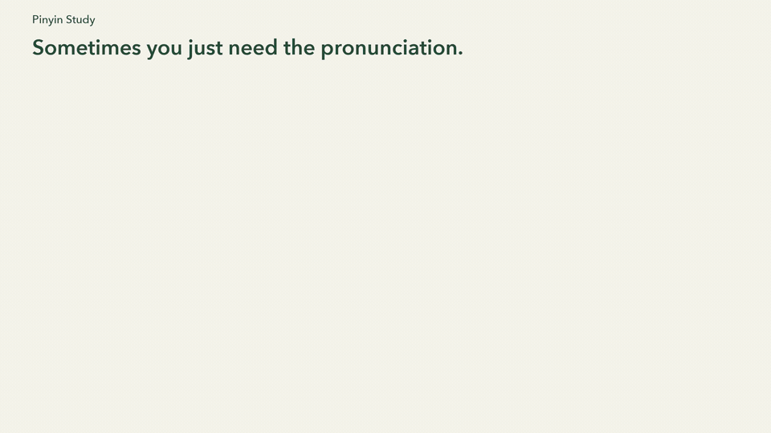

# Pinyin Study

See how Chinese text is pronounced while you read. Select a word or phrase, right-click, and choose **Show pinyin**. Single characters also show stroke order. English meanings are optional.

**[Add to Chrome](https://chromewebstore.google.com/detail/pinyin-study/llfggmdlfkdimnnofjcidjdicnaoiajp)**

## Demo

[Watch the demo](store/demo/pinyin-study-demo.mp4) — a right-click lookup on Zaobao, followed by the stroke order for **车**.

[Product page](https://site-production-7fa7.up.railway.app/pinyin-study) · [Privacy](https://site-production-7fa7.up.railway.app/pinyin-study/privacy) · [Graphics and screenshots](store/README.md)

## Install and use

1. Install [Pinyin Study from the Chrome Web Store](https://chromewebstore.google.com/detail/pinyin-study/llfggmdlfkdimnnofjcidjdicnaoiajp).
2. Select Chinese text on a webpage, right-click, and choose **Show pinyin**.
3. Select a single character to see its stroke order. Turn on **Show meaning** when you want dictionary definitions.

You can also pin Pinyin Study from Chrome’s Extensions menu and click its toolbar icon to look up selected text, or type or paste text into the popup.

Try: 学 → xué; 你好 → nǐ hǎo; 银行 → yín háng; 重庆 → chóng qìng.

## Notes

- Mandarin pinyin with tone marks. A single character shows alternate readings when available; phrases improve pronunciation choices. Names and ambiguous text can still be misread.
- Look up up to 300 characters at a time.
- Toolbar lookup reads the selection in the main page on ordinary HTTP/HTTPS websites. Chrome settings, the Chrome Web Store, the built-in PDF viewer, images, and embedded frames are not supported by toolbar lookup. Paste text into the popup when a page does not support selection lookup.
- Toolbar lookup skips editable fields. Paste text into the popup for text you are writing.
- Everything is processed locally. No tracking, accounts, or saved browsing history. The extension reads a page selection only when you invoke a lookup; it does not monitor webpages in the background.

## Load a development copy

1. Clone or download this repository.
2. Open `chrome://extensions` in desktop Chrome and turn on **Developer mode**.
3. Click **Load unpacked** and select the repository folder containing `manifest.json`.

Keep that folder in place after installation. For everyday use, install the published version from the Chrome Web Store above.

## Credits
Bundled pinyin-pro 3.29.4 (MIT), https://github.com/zh-lx/pinyin-pro. License included in vendor/LICENSE. The dependency is bundled locally; no remotely hosted code is executed.

## Right-click lookup
Select text, right-click, and choose **Show pinyin**. The selected text opens in a small Pinyin Study window. This also supports PDF selections when Chrome provides them in its context menu. The menu appears for any selected text; non-Chinese selections show an input hint.

## Version 1.2
Right-click lookups reuse the existing lookup window, including after the background worker restarts. Closing it allows the next lookup to open a new one. “Show meaning” reveals offline English dictionary entries and remembers your choice. Longer phrases are split by longest dictionary match; this is not sentence translation. Definitions from CC-CEDICT/MDBG, CC BY-SA 4.0 (attribution and conversion notes in vendor/CEDICT-LICENSE.txt).

## Version 1.3
Compact, wider lookup window with no scrolling in the reading area. Character, pinyin and definitions share one card. Unusually long results use Previous/Next pages, preserving all definitions. Existing lookup windows resize on the next right-click lookup.

## Version 1.4
Single-character lookups show an automatic stroke-order animation and Replay control next to the reading. Respects reduced-motion preferences by waiting for Replay. Bundled offline data covers 9,574 characters; missing characters display an unavailable message. Phrases hide the stroke panel. Hanzi Writer 3.7.3 (MIT) and hanzi-writer-data 2.0.1 (Arphic Public License), derived from Make Me a Hanzi, are bundled with their licenses. See https://hanziwriter.org/license.html.

## Version 1.4.5
Replaces automatic selection cards with toolbar and right-click lookups. Uses `activeTab` for temporary access after a toolbar click and `scripting` to read the selection once. No broad host permissions or persistent content scripts are requested. Typing and pasting into the popup still work.
