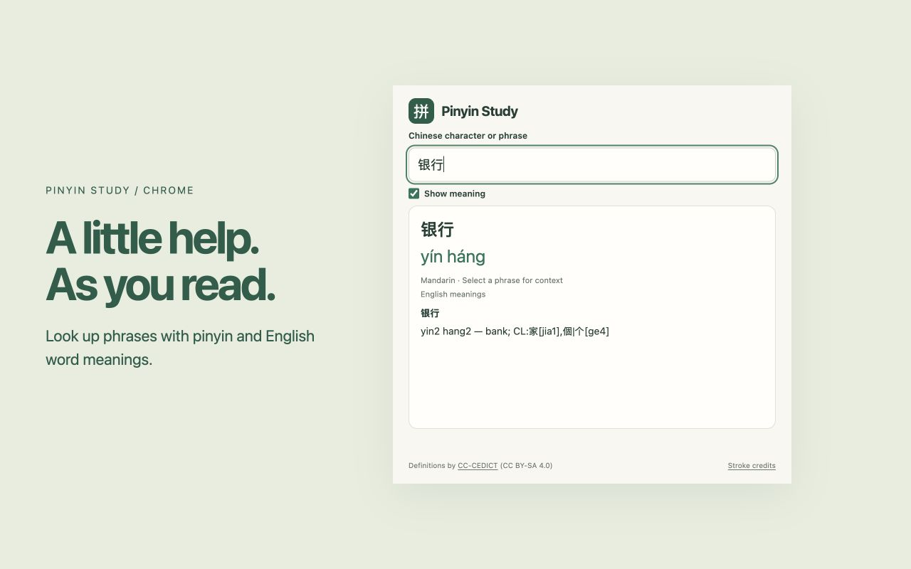
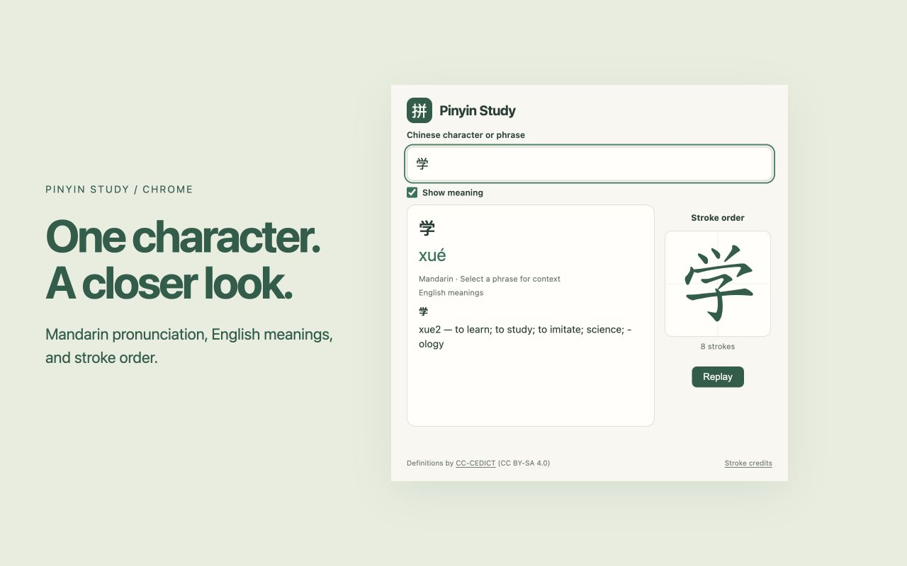

# Pinyin Study media

[Install Pinyin Study from the Chrome Web Store](https://chromewebstore.google.com/detail/pinyin-study/llfggmdlfkdimnnofjcidjdicnaoiajp).

## Demo

[Watch or download the MP4](demo/pinyin-study-demo.mp4). The demo shows a right-click pronunciation lookup on Zaobao and the stroke order for a single character. See [recording details and attribution](demo/README.md).

## Store screenshots

### Pronunciation

### Stroke order

Both screenshots are 1280 × 800 and use the real extension interface in a promotional layout.

## Promotional graphics

[Small promotional tile, 440 × 280](pinyin-study-promo-440x280.png) · [Social graphic](pinyin-study-social.png)

The promotional artwork is distinct from the interface screenshots.

## Submission documents

[Listing copy](LISTING.md) · [Privacy practices](PRIVACY.md) · [Submission status](SUBMISSION-CHECKLIST.md)
