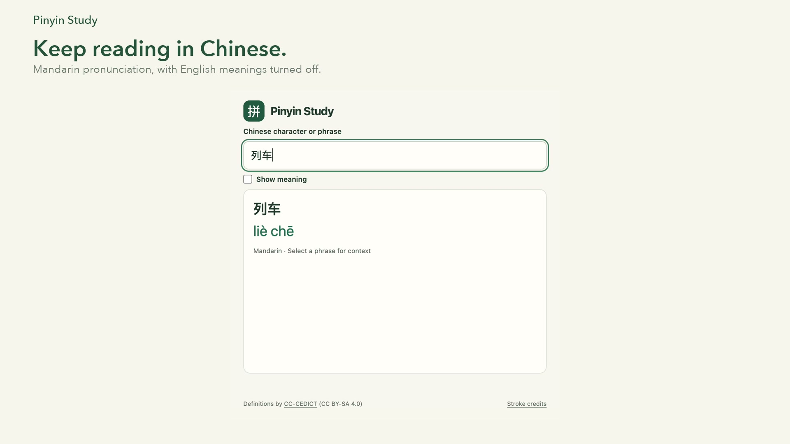

# Pinyin Study demo

[Watch the demo](pinyin-study-demo.mp4)

Sometimes you want to keep reading in Chinese and only need a reminder of how a word is pronounced. This demo uses the right-click **Show pinyin** action for **列车 — liè chē**, then **车 — chē** to show its four-stroke animation. English meanings stay off.

The demo is edited from actual Chrome screen recordings. The recordings were cropped and shortened for readability, with captions added. The extension interface and stroke animation are captured from the running extension.

## Files

- `pinyin-study-demo.mp4` — 1080p video, without audio.
- `pinyin-study-demo.gif` — smaller looping preview.
- `demo-poster.jpg` — video poster.

## Source

Recorded on the [Lianhe Zaobao article about Singapore train models](https://www.zaobao.com.sg/lifestyle/culture/story20260921-9679953). The article, photographs, and Zaobao branding belong to their respective owners and appear here to demonstrate the extension on a Chinese-language webpage. This is an independent Pinyin Study demonstration; it does not imply Zaobao endorsement.
